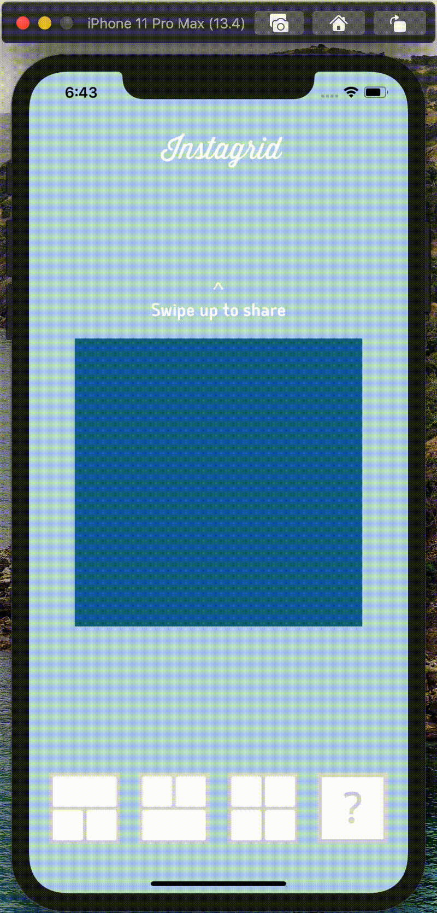

# Instagrid
This project is the fourth of the iOS Developer path from OpenClassrooms. [See Demo](https://youtu.be/gTJTevz59IQ).

This app is:
- supported by all iPhones (from 4s to 11 Pro Max) but not on iPad, 
- available from iOS 11
- responsive in both orientations.

Instagrid allows you to combine several photos in a square format and share it with friends via your favorite applications.

Instagrid supports 3 functionalities.

## Choose Layout
You can choose among different layouts.

## Choose Photo
You can choose a photo from your photo library or take one with your camera by tapping on a plus button.  
If you retap on the same button you can replace the image by another.

## Swipe To Share
You can share your photo montage by swiping up (in portrait mode) or to the left (in landscape mode).

